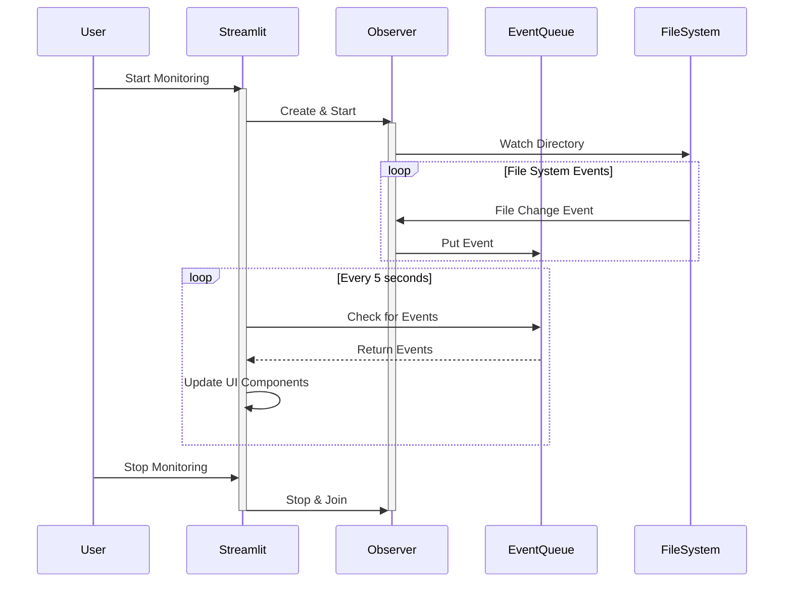
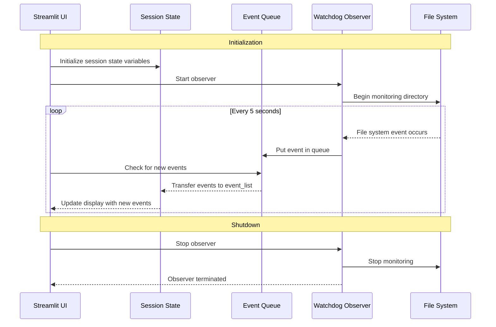
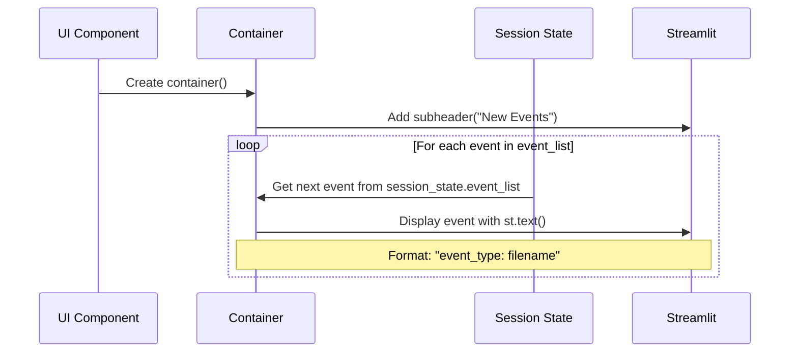

# Streamlit Adventures Part 5

Created: November 22, 2024 11:43 PM
Keywords: Data Engineering, User Interface Design for Data Apps, streamlit
Summary: Rick and Chris developed a real-time file monitor application using Streamlit and the watchdog library. The app updates the UI to reflect file changes in a specified directory, ensuring thread safety through a queue. Enhancements include displaying various file types, filtering out unnecessary files, and allowing user configurations via a YAML file. The application features dynamic UI updates and integrates an interactive grid for file listings, improving user experience and functionality.

# Streamlit Adventures Part 5

## **Building a Real-Time File Monitor with Streamlit**

**A Tale of Synchronization, Queues, and Friendly Banter**

*On a sunny afternoon in Austin, Texas, Rick and Chris were lounging at their favorite coffee shop, laptops open, cups of coffee steaming. Their latest project, Meeting Buddy, was giving them a bit of a headache.*

**Rick:** *Sipping his coffee* "You know, Chris, the file drop synchronization just isn't working as expected. The UI isn't updating when new files are added."

**Chris:** "Yeah, I noticed that. It's like the UI is oblivious to the new markdown files we generate during meetings."

**Rick:** "Exactly! We need a way to have the UI respond in real-time as files are added or removed from the directory."

**Chris:** *Grinning* "Sounds like a job for the watchdog library and a bit of Streamlit magic!"

**Rick:** "Agreed. Let's break it down and build a simple prototype that listens to a directory and updates the UI accordingly."

*They clinked their coffee mugs together, ready to embark on another coding adventure.*

---

## **The Challenge**

Rick and Chris wanted their Meeting Buddy app to display meeting notes in real-time as they were being transcribed and saved as markdown files. However, the UI wasn't updating when new files were added to the directory.

### **Objectives**

- **Monitor a directory** for any file changes (additions, deletions, modifications).
- **Update the Streamlit UI** in real-time to reflect these changes.
- **Ensure thread safety** when communicating between the file system watcher and the Streamlit app.

---

Rick and Chris decided to work on a straightforward project that monitors a file directory. Their goal was to create a simple application that listens for changes in a specified folder. When a file is added to or deleted from the directory, the application would respond with a notification.

To keep the project simple, they implemented a basic user interface that displays messages related to the file events. For instance, if a file is deleted, the UI will show "A file got deleted," and if a file is added, it will display "A file got added."

To accomplish this, they used the `watchdog` library. From `watchdog.observers`, they imported the `Observer` class, and from `watchdog.events`, they imported the `FileSystemEventHandler`. These classes enabled them to effectively monitor the file system events.

## **Building the Prototype**

### **1. Setting Up the Environment**

First, they needed to create a simple Streamlit app that could monitor a directory. They decided to use the `watchdog` library to observe file system events.

**Install the necessary libraries:**

```bash
pip install streamlit watchdog streamlit-autorefresh

```

Let's understand what each library does:

- **streamlit:** The main framework for building web applications with Python
- **watchdog:** A Python library that monitors file system events and triggers actions when files change
- **streamlit-autorefresh:** A Streamlit component that enables automatic page refreshing at specified intervals

### **2. Importing Libraries**

```python
import streamlit as st
from streamlit_autorefresh import st_autorefresh
import os
from pathlib import Path

```

Let's examine each import and its purpose:

- **streamlit (st):** The core library for building our web application interface with Python. Used for creating UI elements like buttons, text displays, and columns.
- **streamlit_autorefresh:** A component that enables automatic page refreshing, which we use to update our file monitoring display every 5 seconds.
- **os:** Provides operating system functionality, used here for path manipulation and checking file existence.
- **pathlib.Path:** Offers object-oriented filesystem paths, making it easier to work with file and directory paths in a cross-platform way.

### **3. Configuring Logging**

Logging is crucial for debugging.

```python
logging.basicConfig(
    filename='file_monitor.log',
    level=logging.DEBUG,
    format='%(asctime)s - %(levelname)s - %(message)s',
    datefmt='%Y-%m-%d %H:%M:%S'
)

```

The logging configuration shown above is crucial for debugging asynchronous and multi-threaded applications. Here's why each logging parameter matters:

- **filename='file_monitor.log':** Creates a persistent log file that captures events even when the UI isn't visible, essential for tracking background thread activities.
- **level=logging.DEBUG:** Captures detailed information about program execution, which is vital when debugging thread synchronization issues.
- **format string:** Includes timestamp, log level, and message - helping to reconstruct the sequence of events across different threads.
- **datefmt:** Provides precise timestamps to track the timing of events, crucial for understanding thread execution order.

When dealing with multiple threads (like the watchdog observer thread and Streamlit's main thread), logging becomes invaluable because:

- It helps identify race conditions and timing-related bugs that may not be immediately visible in the UI
- It provides a chronological record of events happening in different threads simultaneously
- It enables post-mortem debugging by examining the log file after issues occur
- It helps track the flow of data between the file system observer and the main application thread

Without proper logging, debugging asynchronous operations would be like trying to solve a puzzle in the dark - you'd be missing crucial pieces of information about what's happening behind the scenes.

It is important to note that a Streamlit application operates in its own thread, while the `observer` which we will show shortly, fires events in a different thread. Consequently, when an event occurs, it is essential to have a method for Streamlit to safely read the event data.

To address this challenge, the team decided to use a queue from Python. In their file handler, they set up the queue to handle incoming events whenever an event is triggered.

```python
import queue
import logging
from watchdog.observers import Observer
from watchdog.events import FileSystemEventHandler
```

We use these classes to implement our thread-safe dance between file event observation and Streamlit

- **queue:** Implements thread-safe queue data structures. We use it to safely communicate between the file monitoring thread and Streamlit's main thread.
- **logging:** Provides a flexible framework for generating log messages, which helps with debugging and monitoring the application.
- **watchdog.observers.Observer:** The main class that monitors the filesystem for changes. It runs in a separate thread and notifies us of file events.
- **watchdog.events.FileSystemEventHandler:** A base class for handling file system events like file creation, modification, or deletion.

### **4. Creating the File Event Handler**

They needed a handler that would react to any file system events.

```python
class FileEventHandler(FileSystemEventHandler):
    def __init__(self, event_queue):
        super().__init__()
        self.event_queue = event_queue

    def on_any_event(self, event):
        if not event.is_directory:
            self.event_queue.put(event)
            logging.info(f"Event detected: {event.event_type} - {event.src_path}")

```

Let's examine the `FileEventHandler` class in detail:

- **Class Initialization:** Takes an event queue as a parameter to store file system events
- **Event Detection:** The `on_any_event` method triggers for all file system events (creation, modification, deletion)
- **Directory Filtering:** Ignores directory events with the `if not event.is_directory` check
- **Event Queue:** Each file event is added to the queue using `put()` for thread-safe communication
- **Logging:** Events are logged with details including event type and file path for debugging purposes

This handler serves as the bridge between the file system events and our Streamlit application, ensuring thread-safe event processing.

The file handler processes file system events and logs relevant information. The UI includes a button for starting the observation of a specified directory and when that happens this file_handler is passed to the observer. The `startObserver` method creates a `FileEventHandler` and an `Observer` for the specified path.

### **5. Starting and Stopping the Observer**

Methods to manage the observer lifecycle.

```python
def start_observer(path, event_queue):
    logging.info("Starting observer")
    event_handler = FileEventHandler(event_queue)
    observer = Observer()
    observer.schedule(event_handler, path, recursive=False)
    observer.start()
    logging.info("Observer started")
    return observer

def stop_observer(observer):
    logging.info("Stopping observer")
    observer.stop()
    observer.join()
    logging.info("Observer stopped")

```

The observer management code above handles the lifecycle of the file system monitoring:

- **start_observer function:** Creates and initializes a new watchdog Observer instance with the specified path and event queue. It returns the observer object for later management.
- **stop_observer function:** Safely shuts down the observer by calling stop() and join(), ensuring all resources are properly cleaned up.

Key aspects of these functions:

- **Thread Safety:** The observer runs in its own thread, separate from the main Streamlit thread
- **Logging:** Each major operation is logged for debugging purposes
- **Resource Management:** The observer is properly started and stopped to prevent memory leaks

These functions form the core of the file monitoring system, managing the background thread that watches for file system changes.

The file handler is initialized to respond to any file system events. When an event occurs, it places the event into a queue, logs the event type, and records the source path, which can be seen in the log.

The user interface features a button that, when clicked, initiates the observation of a path entered by the user. For example, users may input their "Downloads" directory.

Upon hitting the startObserver method, the following actions take place:

- A FileEventHandler is created.
- An Observer is instantiated and scheduled.
- The initial path entered in the UI is passed to the FileEventHandler.
- The observer is then started using the observer.start() method.
- The `startObserver` returns an observe that is stored into the session_state of the Streamlit app. Each user get their own session state so each user would get their own observer in this example.

### **6. Displaying File Listings**

Methods to display current directory contents and new events.

```python
def display_file_listing(folder_path, ui_component):
    with ui_component.container():
        st.subheader("Current Directory Contents")
        if os.path.exists(folder_path):
            files = sorted(Path(folder_path).iterdir(), key=os.path.getmtime, reverse=True)
            for file in files:
                if file.is_file():
                    st.text(f"📄 {file.name}")
        else:
            st.error("The specified folder path does not exist.")

def display_new_events(ui_component):
    with ui_component.container():
        st.subheader("New Events")
        for event in st.session_state.event_list:
            st.text(f"{event.event_type}: {os.path.basename(event.src_path)}")

```

The `display_new_events` function creates a dedicated container in the Streamlit UI to show file system events as they occur. Here's how it works:

- Uses a container to create a distinct section in the UI for event display
- Shows a "New Events" subheader to clearly label the section
- Iterates through the event list stored in the session state
- For each event, displays both the event type (created, modified, deleted) and the filename

These UI components have a special property - they only update at specific refresh intervals, which we'll demonstrate later. Streamlit has an elegant way of updating only specific parts of the UI, so when something needs to change in the background, we don't need to redraw the entire interface - just the parts we're interested in, as we'll show shortly. 



This sequence diagram illustrates the interaction between different components of our file monitoring system:

- The User initiates monitoring through the Streamlit interface
- The Observer runs in a separate thread, watching for file system changes
- Events are communicated through a thread-safe EventQueue
- Streamlit periodically checks the queue and updates specific UI components
- The process continues until the user stops monitoring

### **7. Managing Session State**

Initializing the session state variables.

```python
if 'event_queue' not in st.session_state:
    st.session_state.event_queue = queue.Queue()
if 'observer' not in st.session_state:
    st.session_state.observer = None
if 'event_list' not in st.session_state:
    st.session_state.event_list = []
if 'monitoring' not in st.session_state:
    st.session_state.monitoring = False

```

The session state initialization code above sets up four key variables that persist across Streamlit's reruns:

- **event_queue:** A thread-safe queue to store file system events from the watchdog observer
- **observer:** Stores the watchdog Observer instance that monitors the file system
- **event_list:** Maintains a list of processed events to display in the UI
- **monitoring:** A boolean flag indicating whether file monitoring is active

These variables are crucial for maintaining state between reruns and ensuring proper communication between the file system observer thread and Streamlit's main thread.

Rick and Chris discussed this at length. They talked about important this was. Chris explained that the observer begins by calling `observer.start()` in its own thread to populate the event queue. There is also a method named `stopObserver`, which halts the observer and then joins the current thread.

To initiate the process, when the application starts, it checks whether an event queue is already present in the session state. This is done through the statement `st.sessionState.eventQueue = q.queue`. The session corresponds to a single user, and this operation effectively associates the state of the queue with that particular user.

- The observer starts in its own thread and populates a queue.
- A method called "stop observer" stops the observer and joins the current thread.
- The application checks the session state for an existing event queue upon startup.
- The event queue is associated with a specific user session.

---

During the meeting, 

### **8. The Main Function**

Putting it all together.

```python
def main():
    st.title("Real-Time File Viewer with Streamlit")
    logging.info("Starting Real-Time File Viewer")

    folder_path = st.text_input(
        "Enter folder path to monitor",
        value=os.path.expanduser("~/Downloads")
    )

    if not os.path.exists(folder_path):
        st.error("Please enter a valid folder path.")
        logging.info("Invalid folder path")
        st.stop()

    col1, col2 = st.columns([2, 1])

    with col1:
        if not st.session_state.monitoring:
            if st.button("Start Monitoring", use_container_width=True):
                st.session_state.observer = start_observer(folder_path, st.session_state.event_queue)
                st.session_state.monitoring = True
                st.success(f"Started monitoring {folder_path}")
                logging.info(f"Started monitoring {folder_path}")
        else:
            if st.button("Stop Monitoring", use_container_width=True):
                stop_observer(st.session_state.observer)
                st.session_state.observer = None
                st.session_state.monitoring = False
                st.success("Stopped monitoring")
                logging.info("Stopped monitoring")

    new_events = st.empty()
    file_listing = st.empty()

    def check_events_and_update():
        events_processed = False
        while not st.session_state.event_queue.empty():
            event = st.session_state.event_queue.get()
            st.session_state.event_list.append(event)
            events_processed = True
        logging.info(f"Processed events: {len(st.session_state.event_list)}")

    refresh_interval = 5000  # Refresh every 5 seconds
    st_autorefresh(interval=refresh_interval, key="refresh_area")

    if st.session_state.monitoring:
        check_events_and_update()

    display_new_events(new_events)
    display_file_listing(folder_path, file_listing)

if __name__ == "__main__":
    main()

```

---

The main function serves as the entry point for our Streamlit application and orchestrates all the key components. Let's break down its functionality:

- **UI Setup:** Creates a title and input field for the folder path, defaulting to the user's Downloads directory
- **Path Validation:** Checks if the provided folder path exists before proceeding
- **Control Panel:** Uses columns to organize the monitoring controls, with start/stop buttons that toggle the observer
- **Event Processing:** Implements the check_events_and_update function to process events from the queue
- **Auto-refresh:** Sets up a 5-second refresh interval to keep the UI updated with new events
- **Display Components:** Creates empty containers for displaying new events and the current file listing

The function maintains a clean separation of concerns while providing real-time updates through the combination of the watchdog observer and Streamlit's UI components.

## Streamlit Magic

The main method has some Streamlit magic in here. Let’s break it down. 

The main method features a refresh area that significantly enhances efficiency of how the UI is rendered. Specifically, it uses `refresh_area`, which is assigned to `st.container`. This container houses two empty components that are periodically refreshed.

The advantage of this approach is that in a large user interface, only these designated areas are redrawn rather than the entire screen, leading to better performance.

Within the `refresh_area`, we define two key components: `new_events` and `file_monitor_refresh`, both initialized using `st.empty`. These components serve to manage incoming events and monitor file changes, respectively.

```python
    refresh_area = st.container()

    with refresh_area:
        new_events = st.empty()
        file_monitor_refresh = st.empty()

```

The code above demonstrates how to set up a refresh area in Streamlit for dynamic content updates. Here's what each line does:

- `refresh_area = st.container()`: Creates a container that will hold the dynamic content sections
- `with refresh_area:`: Establishes a context for placing components inside the container
- `new_events = st.empty()`: Creates an empty placeholder for displaying new file system events
- `file_monitor_refresh = st.empty()`: Creates another empty placeholder for the file listing display

These empty placeholders are crucial because they allow us to update specific parts of the UI without refreshing the entire page. The content in these placeholders will be updated at regular intervals defined by the refresh interval.

The refresh interval can be set to different durations, such as 5 or 15 seconds (probably don’t go under 500ms). This interval determines how frequently the application checks for and displays newly added files.

A key feature is the `st_autorefresh`, which works in tandem with the refresh interval and manages the container holding our two main settings.

The main container passed to  `st_autorefresh` encompasses two sub-containers that make up the `refresh_area`. The name `refresh_area` refers to the component we defined in the last code listing. While the refresh interval controls how often the screen updates, the `refresh_area` specifies exactly which parts of the screen receive these updates.

The `display_new_events` and `display_file_listing` functions we discussed earlier will work with these empty containers as parameters, `new_events` and `file_monitor_refresh` respectively. They'll periodically refresh specific sections of the user interface (UI), focusing on two key areas: `new_events` and the `file_monitor_refresh`—both contained within the `refresh_area` container. 

```python
    # Set the refresh interval (in milliseconds)
    refresh_interval = 15000  # Adjust as needed (e.g., 500 milliseconds = 0.5 seconds)

    # Autorefresh the app
    st_autorefresh(interval=refresh_interval, key="refresh_area")

    # Only check events and update if monitoring is active
    if 'monitoring' in st.session_state and st.session_state.monitoring:
        check_events_and_update()

    display_new_events(folder_path, new_events)
    display_file_listing(folder_path, file_monitor_refresh)
```

The code listing above demonstrates how the main monitoring loop works in the Streamlit application. Here's a breakdown of its key components:

- **Refresh Interval:** Sets a 15-second timer for updating the UI components automatically
- **Auto-refresh Setup:** Uses `st_autorefresh` to periodically refresh specific areas of the interface
- **Conditional Event Processing:** Only checks for and processes new events when monitoring is active
- **Display Updates:** Calls two key display functions to show:
    - New events that occurred in the monitored directory
    - Current listing of files in the monitored folder

The code efficiently manages UI updates by:

- Only refreshing when necessary (monitoring is active)
- Using empty containers to update specific UI sections
- Maintaining thread safety through proper queue management
- Separating display logic from event processing



This sequence diagram illustrates the flow of data and control between the different components of our file monitoring system:

- The Streamlit UI initializes the session state and starts the observer
- The Watchdog Observer monitors the file system in a separate thread
- Events flow from the file system through the observer into the queue
- The UI periodically checks the queue and updates the display
- The process continues until the user stops monitoring

## **Understanding the Code**

### **Communicating Between Threads**

Streamlit runs in a single thread, while the `watchdog` observer runs in a separate thread. To safely communicate between them, Rick and Chris used a thread-safe queue.

```python
st.session_state.event_queue = queue.Queue()

```

Whenever a file system event occurs, it's put into the queue.

```python
def on_any_event(self, event):
    if not event.is_directory:
        self.event_queue.put(event)

```

The Streamlit app periodically checks this queue and updates the UI.

If we are monitoring, and the UI re-renders, then this method will get called periodically to drain the queue and add items to the `event_list` stored in Streamlit session state. 

```python
    def check_events_and_update():
        events_processed = False
        while not st.session_state.event_queue.empty():
            event = st.session_state.event_queue.get()
            st.session_state.event_list.append(event)
            events_processed = True
        logging.info(f"Processed events: {len(st.session_state.event_list)}")
```

The code listing shows the `check_events_and_update()` function which is responsible for processing events from the queue. Here's how it works:

- It checks if there are any events in the queue using `st.session_state.event_queue.empty()`
- While events exist, it retrieves them one by one using `event_queue.get()`
- Each event is appended to the `event_list` stored in session state for display
- A flag `events_processed` tracks whether any events were handled
- Finally, it logs the total number of events processed for debugging purposes

This function acts as a bridge between the watchdog observer thread and Streamlit's UI thread, safely transferring file system events through the queue system.

### **Auto-Refreshing the UI**

They used the `st_autorefresh` function to refresh the UI at regular intervals.

```python
st_autorefresh(interval=refresh_interval, key="refresh_area")

```

### **Displaying New Events**

As events are processed, they're appended to the `queue` which gets drained by `check_events_and_update` and put into`st.session_state.event_list`, which is then displayed in the UI using `display_new_events`. The `ui_component` passed as a parameter is in the `refresh_area` .

```python
def display_new_events(ui_component):
    with ui_component.container():
        st.subheader("New Events")
        for event in st.session_state.event_list:
            st.text(f"{event.event_type}: {os.path.basename(event.src_path)}")

```

The code shown above demonstrates how to display new events in the Streamlit UI. Here's what it does:

- Creates a container using `ui_component.container()` to group related UI elements
- Displays a "New Events" subheader to label the section
- Iterates through each event stored in `st.session_state.event_list`
- For each event, displays a formatted string showing the event type (created/modified/deleted) and the filename

The function uses Streamlit's text components to create a simple but effective event log that updates as new file system events occur. The `os.path.basename()` function extracts just the filename from the full path for cleaner display.



This sequence diagram illustrates the flow of the `display_new_events` function:

1. The UI component creates a container to group the elements
2. A subheader is added to label the events section
3. The function loops through events stored in session state
4. Each event is formatted and displayed as text in the container

---

## **Rick and Chris Reflect**

**Chris:** "This is working great! The UI now updates whenever a file is added or removed."

**Rick:** *Nods* "Yeah, using the queue to communicate between threads was the key. And the auto-refresh ensures the UI stays up-to-date."

**Chris:** "Plus, it's scalable. We can now integrate this into Meeting Buddy and have real-time updates during our meetings."

**Rick:** "Absolutely. Let's push this to the repo and share it with the team."

---

## **Key Takeaways**

- **Thread Communication:** Using a queue to safely pass data between threads.
- **Real-Time Updates:** Leveraging `st_autorefresh` to refresh the UI.
- **Streamlit Session State:** Storing variables that persist across reruns.

---

## **Full Code Listing**

Here's the complete code for the real-time file monitor application.

```python
import streamlit as st
from streamlit_autorefresh import st_autorefresh
import os
from pathlib import Path
import queue
import logging
from watchdog.observers import Observer
from watchdog.events import FileSystemEventHandler

# Configure logging
logging.basicConfig(
    filename='file_monitor.log',
    level=logging.DEBUG,
    format='%(asctime)s - %(levelname)s - %(message)s',
    datefmt='%Y-%m-%d %H:%M:%S'
)

# Define the event handler for watchdog
class FileEventHandler(FileSystemEventHandler):
    def __init__(self, event_queue):
        super().__init__()
        self.event_queue = event_queue

    def on_any_event(self, event):
        if not event.is_directory:
            self.event_queue.put(event)
            logging.info(f"Event detected: {event.event_type} - {event.src_path}")

# Function to start the watchdog observer
def start_observer(path, event_queue):
    logging.info("Starting observer")
    event_handler = FileEventHandler(event_queue)
    observer = Observer()
    observer.schedule(event_handler, path, recursive=False)
    observer.start()
    logging.info("Observer started")
    return observer

# Function to stop the watchdog observer
def stop_observer(observer):
    logging.info("Stopping observer")
    observer.stop()
    observer.join()
    logging.info("Observer stopped")

# Function to display the file listing
def display_file_listing(folder_path, ui_component):
    with ui_component.container():
        st.subheader("Current Directory Contents")
        if os.path.exists(folder_path):
            files = sorted(Path(folder_path).iterdir(), key=os.path.getmtime, reverse=True)
            for file in files:
                if file.is_file():
                    st.text(f"📄 {file.name}")
        else:
            st.error("The specified folder path does not exist.")

# Function to display new events
def display_new_events(ui_component):
    with ui_component.container():
        st.subheader("New Events")
        for event in st.session_state.event_list:
            st.text(f"{event.event_type}: {os.path.basename(event.src_path)}")

# Initialize session state variables
if 'event_queue' not in st.session_state:
    st.session_state.event_queue = queue.Queue()
if 'observer' not in st.session_state:
    st.session_state.observer = None
if 'event_list' not in st.session_state:
    st.session_state.event_list = []
if 'monitoring' not in st.session_state:
    st.session_state.monitoring = False

def main():
    st.title("Real-Time File Viewer with Streamlit")
    logging.info("Starting Real-Time File Viewer")

    folder_path = st.text_input(
        "Enter folder path to monitor",
        value=os.path.expanduser("~/Downloads")
    )

    if not os.path.exists(folder_path):
        st.error("Please enter a valid folder path.")
        logging.info("Invalid folder path")
        st.stop()

    col1, col2 = st.columns([2, 1])

    with col1:
        if not st.session_state.monitoring:
            if st.button("Start Monitoring", use_container_width=True):
                st.session_state.observer = start_observer(folder_path, st.session_state.event_queue)
                st.session_state.monitoring = True
                st.success(f"Started monitoring {folder_path}")
                logging.info(f"Started monitoring {folder_path}")
        else:
            if st.button("Stop Monitoring", use_container_width=True):
                stop_observer(st.session_state.observer)
                st.session_state.observer = None
                st.session_state.monitoring = False
                st.success("Stopped monitoring")
                logging.info("Stopped monitoring")

    new_events = st.empty()
    file_listing = st.empty()

    def check_events_and_update():
        events_processed = False
        while not st.session_state.event_queue.empty():
            event = st.session_state.event_queue.get()
            st.session_state.event_list.append(event)
            events_processed = True
        logging.info(f"Processed events: {len(st.session_state.event_list)}")

    refresh_interval = 5000  # Refresh every 5 seconds
    st_autorefresh(interval=refresh_interval, key="refresh_area")

    if st.session_state.monitoring:
        check_events_and_update()

    display_new_events(new_events)
    display_file_listing(folder_path, file_listing)

if __name__ == "__main__":
    main()

```

---

## **Running the Application**

To run the application, use the following command:

```bash
streamlit run file_monitor.py

```

Replace `file_monitor.py` with the name of your Python file.

---

## **Wrapping Up**

Rick and Chris successfully built a prototype that met their objectives. By using the `watchdog` library and Streamlit's features, they created a real-time file monitoring app that could be integrated into their Meeting Buddy project.

But Chris says to Rick: “You know what Rick”.

Rick responds “What Chris?”. 

Chris: “This application works but it is sort of boring”

Rick: “Let’s fix it up.. I want to add a happy clown!”

Chris: “Of course you do. Of course you do”.

---

## **Key Concepts Glossary**

| **Term** | **Definition** | **Related Components** |
| --- | --- | --- |
| Watchdog | A Python library that monitors file system events. | `Observer`, `FileSystemEventHandler` |
| Streamlit Session State | A way to store variables across reruns in a Streamlit app. | `st.session_state` |
| Thread Communication | Safely passing data between threads using thread-safe structures. | `queue.Queue` |
| Auto-Refresh | Refreshing the Streamlit app at set intervals for real-time updates. | `st_autorefresh` |
| File System Events | Actions like file creation, modification, or deletion detected by Watchdog. | `event.event_type`, `event.src_path` |

---


## **Related Links**

- [Streamlit Documentation](https://docs.streamlit.io/)
- [Watchdog Documentation](https://python-watchdog.readthedocs.io/en/latest/)
- [Streamlit Auto-Refresh Component](https://pypi.org/project/streamlit-autorefresh/)
- [Streamlit Gallery](https://streamlit.io/gallery) - for inspiration and examples
- [Article: Streamlit Part 4- Form Validation Part 2](https://rick-hightower.notion.site/article-streamlit-part-4-form-validation-part-2/)
- [Article: Streamlit Part 5 - Working with Refresh and background threads](https://www.notion.so/Streamlit-Adventures-Part-5-147d6bbdbbea80d0ad21dc782a3a2602?pvs=21)

[Article: Streamlit Part 3 - Form Validation Part 1](https://www.notion.so/Article-Streamlit-Part-3-Form-Validation-Part-1-13cd6bbdbbea8020ad11fb13b103119d?pvs=21)

[Streamlit Part 2: Layouts, Components and Graphs](https://www.notion.so/Streamlit-Part-2-Layouts-Components-and-Graphs-137d6bbdbbea80d087c4ead0e0bee592?pvs=21)

[**Part 1: Conversation about Streamlit while walking in the park**](https://www.notion.so/Part-1-Conversation-about-Streamlit-while-walking-in-the-park-133d6bbdbbea81cf8195c8ccdb1ec17c?pvs=21)

---

# Part 2: **Enhancing the Real-Time File Monitor**

*With caffeine coursing through their veins, Rick and Chris sat back down with fresh cups of coffee.*

**Chris:** *Grinning mischievously* "Alright, Rick. You wanted a happy clown? Let's see how we can make this app more... entertaining."

**Rick:** *Laughs* "Maybe not a literal clown, but let's definitely make it more engaging. We've got the basics down; now let's show off what Streamlit can really do!"

*They started brainstorming ideas to enhance their file monitor application.*

---

## **The Brainstorming Session**

Rick and Chris wanted to make their application more visually appealing and functional. They listed out enhancements:

1. **Display Various File Types:**
    - Show code files with syntax highlighting.
    - Render images, audio, and video files.
    - Display markdown files with proper formatting.
2. **Improve Event Handling:**
    - Include timestamps for each file event.
    - Filter out irrelevant system files like `.DS_Store`.
3. **Enhanced UI Elements:**
    - Implement a tree view for the file listing.
    - Display recent events in a table with filters.
    - Add a section to preview the latest file.
4. **User Configurations:**
    - Use a YAML config file to set default settings.
    - Allow users to change the monitored directory.
    - Provide a slider to adjust the refresh rate.

---

## **Implementing the Enhancements**

### **1. Adding Timestamps to File Events**

**Problem:**

**Solution:**

Create a `FileEventWrapper` class that adds a timestamp to each event.

**Code:**

```python
from datetime import datetime

class FileEventWrapper:
    def __init__(self, event):
        self.event_type = event.event_type
        self.src_path = event.src_path
        self.timestamp = datetime.now().strftime('%Y-%m-%d %H:%M:%S')

    def to_dict(self):
        return {
            "event_type": self.event_type,
            "src_path": self.src_path,
            "timestamp": self.timestamp
        }

```

**Explanation:**

- **Initialization:** Captures the event type, source path, and current timestamp.
- **`to_dict` Method:** Converts the event data into a dictionary for easy display and logging.

**Integration with Event Handler:**

```python
class FileEventHandler(FileSystemEventHandler):
    def __init__(self, event_queue):
        super().__init__()
        self.event_queue = event_queue

    def on_any_event(self, event):
        if not event.is_directory:
            wrapped_event = FileEventWrapper(event)
            self.event_queue.put(wrapped_event)
            logging.info(f"Event detected: {wrapped_event.event_type} - {wrapped_event.src_path} at {wrapped_event.timestamp}")

```

---

### **2. Filtering Out Unnecessary Files**

**Problem:**

System files like `.DS_Store` and `.localized` were cluttering the event logs and file listings.

**Solution:**

Modify the event handler and file listing functions to exclude these files.

**Code:**

```python
def on_any_event(self, event):
    if not event.is_directory and not any(ignored in event.src_path for ignored in [".DS_Store", ".localized"]):
        # Process event

```

**Explanation:**

- **Check for Ignored Files:** The condition `not any(ignored in event.src_path for ignored in [".DS_Store", ".localized"])` ensures that events related to these files are skipped.

---

### **3. Displaying Files in a Tree View**

**Problem:**

The file listing was a simple text list, lacking structure and interactivity.

**Solution:**

Use the `streamlit-aggrid` library to display files in a grid with sorting and filtering capabilities.

**Installation:**

```bash
pip install streamlit-aggrid

```

**Code:**

```python
from st_aggrid import AgGrid
from st_aggrid.grid_options_builder import GridOptionsBuilder

def display_file_listing_as_tree(folder_path, ui):
    with ui.container():
        st.subheader("Current Directory Contents")
        if os.path.exists(folder_path):
            files_data = []
            for file in Path(folder_path).iterdir():
                if file.name not in [".DS_Store", ".localized"]:
                    files_data.append({
                        "file_name": file.name,
                        "file_type": "Folder" if file.is_dir() else "File",
                        "modified_time": datetime.fromtimestamp(file.stat().st_mtime).strftime('%Y-%m-%d %H:%M:%S'),
                        "size": file.stat().st_size,
                        "path": str(file)
                    })

            grid_options = GridOptionsBuilder.from_dataframe(pd.DataFrame(files_data))
            grid_options.configure_column("path", hide=True)
            AgGrid(pd.DataFrame(files_data), gridOptions=grid_options.build())
        else:
            st.error("The specified folder path does not exist.")

```

**Explanation:**

- **File Data Collection:** Gathers file information, excluding ignored files.
- **AgGrid Integration:** Displays the files in an interactive grid, allowing users to sort and filter.

---

### **4. Displaying Recent Events in a Table**

**Problem:**

Events were displayed as plain text, making it hard to track and analyze them.

**Solution:**

Show events in a table with columns for event type, file name, and timestamp, filtering out events older than 5 minutes.

**Code:**

```python
import pandas as pd

def display_recent_events(new_events):
    with new_events:
        st.subheader("New Events")
        if st.session_state.event_list:
            cutoff_time = datetime.now() - timedelta(minutes=5)
            recent_events = [
                event.to_dict() for event in st.session_state.event_list
                if datetime.strptime(event.timestamp, '%Y-%m-%d %H:%M:%S') >= cutoff_time
            ]
            if recent_events:
                st.dataframe(pd.DataFrame(recent_events))
            else:
                st.info("No events in the last 5 minutes.")

```

**Explanation:**

- **Filtering Events:** Only includes events from the last 5 minutes.
- **Dataframe Display:** Uses `st.dataframe()` to render the events in a table format.

---

### **5. Previewing the Latest File**

**Problem:**

Users couldn't easily see the contents of the most recently modified file.

**Solution:**

Add a section to display the latest file, handling various file types appropriately.

**Code:**

```python
def display_latest_file(folder_path, ui):
    with ui:
        st.subheader("Latest File")
        if os.path.exists(folder_path):
            valid_files = [file for file in Path(folder_path).iterdir()
                           if file.name not in [".DS_Store", ".localized"]]
            if not valid_files:
                st.warning("No valid files found in the directory.")
                return

            latest_file = max(valid_files, key=os.path.getmtime)
            if latest_file.suffix in ['.java']:
                st.code(latest_file.read_text(), language='java')
            elif latest_file.suffix in ['.py']:
                st.code(latest_file.read_text(), language='python')
            elif latest_file.suffix in ['.md']:
                st.markdown(latest_file.read_text())
            elif latest_file.suffix in ['.csv']:
                st.subheader(f"Preview of {latest_file.name}")
                try:
                    df = pd.read_csv(latest_file)
                    st.dataframe(df)
                except Exception as e:
                    st.error(f"Error reading CSV file: {e}")
            elif latest_file.suffix in ['.jpg', '.png']:
                st.image(str(latest_file))
            elif latest_file.suffix in ['.mp3', '.wav']:
                st.audio(str(latest_file))
            elif latest_file.suffix in ['.mp4', '.avi']:
                st.video(str(latest_file))
            else:
                st.write({
                    "File Name": latest_file.name,
                    "Size (bytes)": latest_file.stat().st_size,
                    "Modified": datetime.fromtimestamp(latest_file.stat().st_mtime).strftime('%Y-%m-%d %H:%M:%S')
                })
        else:
            st.error("The specified folder path does not exist.")

```

**Explanation:**

- **File Type Handling:** Uses the file extension to determine how to display the file.
- **Error Handling:** Provides informative messages if the file cannot be displayed.

---

### **6. Adding a YAML Configuration File**

**Problem:**

Users couldn't set default configurations like the refresh rate or starting directory.

**Solution:**

Use a `.file_viewer.yaml` file to store default settings.

**Sample `.file_viewer.yaml`:**

```yaml
refresh_rate: 5000
starting_directory: ~/Downloads

```

**Code to Load Configurations:**

```python
import yaml

def load_config():
    config_path = Path(".file_viewer.yaml")
    if config_path.exists():
        with open(config_path, "r") as file:
            return yaml.safe_load(file)
    return {"refresh_rate": 15000, "starting_directory": "~/Downloads"}

config = load_config()

```

**Explanation:**

- **YAML Parsing:** Uses the `yaml` library to read configurations.
- **Default Settings:** Provides fallback values if the config file doesn't exist.

---

### **7. Adjustable Refresh Rate and Folder Selection**

**Problem:**

The refresh rate was fixed, and changing the monitored directory wasn't user-friendly.

**Solution:**

- Add a slider to adjust the refresh rate.
- Provide an input field for users to enter the directory path.

**Code:**

```python
# Adjust refresh rate
refresh_interval = st.slider("Set Refresh Interval (ms)", min_value=500, max_value=30000, value=config['refresh_rate'])
st_autorefresh(interval=refresh_interval, key="refresh_area")

# Folder selection
folder_path = st.text_input("Enter the folder path to monitor:", value=config['starting_directory'])
folder_path = os.path.expanduser(folder_path)

```

**Explanation:**

- **Refresh Rate Slider:** Allows users to set the interval between UI refreshes.
- **Folder Path Input:** Users can specify which directory to monitor.

---

## **Putting It All Together**

After implementing the enhancements, Rick and Chris refactored their code to integrate all the new features seamlessly.

**Complete Enhanced Code Listing:**

```python
import streamlit as st
from streamlit_autorefresh import st_autorefresh
from st_aggrid import AgGrid
from st_aggrid.grid_options_builder import GridOptionsBuilder
from pathlib import Path
import pandas as pd
import queue
import logging
from watchdog.observers import Observer
from watchdog.events import FileSystemEventHandler
from datetime import datetime, timedelta
import yaml
import os

# Configure logging
logging.basicConfig(
    filename='file_monitor.log',
    level=logging.DEBUG,
    format='%(asctime)s - %(levelname)s - %(message)s',
    datefmt='%Y-%m-%d %H:%M:%S'
)

# Define FileEventWrapper
class FileEventWrapper:
    def __init__(self, event):
        self.event_type = event.event_type
        self.src_path = event.src_path
        self.timestamp = datetime.now().strftime('%Y-%m-%d %H:%M:%S')

    def to_dict(self):
        return {
            "event_type": self.event_type,
            "src_path": self.src_path,
            "timestamp": self.timestamp
        }

# Define the event handler for watchdog
class FileEventHandler(FileSystemEventHandler):
    def __init__(self, event_queue):
        super().__init__()
        self.event_queue = event_queue

    def on_any_event(self, event):
        if not event.is_directory and not any(ignored in event.src_path for ignored in [".DS_Store", ".localized"]):
            wrapped_event = FileEventWrapper(event)
            self.event_queue.put(wrapped_event)
            logging.info(
                f"Event detected: {wrapped_event.event_type} - {wrapped_event.src_path} at {wrapped_event.timestamp}")

# Function to start the watchdog observer
def start_observer(path, event_queue):
    logging.info("Starting observer")
    event_handler = FileEventHandler(event_queue)
    observer = Observer()
    observer.schedule(event_handler, path, recursive=False)
    observer.start()
    logging.info("Observer started")
    return observer

# Function to stop the watchdog observer
def stop_observer(observer):
    logging.info("Stopping observer")
    observer.stop()
    observer.join()
    logging.info("Observer stopped")

# Function to load configuration
def load_config():
    config_path = Path(".file_viewer.yaml")
    if config_path.exists():
        with open(config_path, "r") as file:
            return yaml.safe_load(file)
    return {"refresh_rate": 15000, "starting_directory": "~/Downloads"}

config = load_config()

# Initialize session state
if 'event_queue' not in st.session_state:
    st.session_state.event_queue = queue.Queue()
if 'observer' not in st.session_state:
    st.session_state.observer = None
if 'event_list' not in st.session_state:
    st.session_state.event_list = []
if 'monitoring' not in st.session_state:
    st.session_state.monitoring = False

# Function to display the file listing as a tree view
def display_file_listing_as_tree(folder_path, ui):
    with ui.container():
        st.subheader("Current Directory Contents")
        if os.path.exists(folder_path):
            files_data = []
            for file in Path(folder_path).iterdir():
                if file.name not in [".DS_Store", ".localized"]:
                    files_data.append({
                        "file_name": file.name,
                        "file_type": "Folder" if file.is_dir() else "File",
                        "modified_time": datetime.fromtimestamp(file.stat().st_mtime).strftime('%Y-%m-%d %H:%M:%S'),
                        "size": file.stat().st_size,
                        "path": str(file)
                    })

            grid_options = GridOptionsBuilder.from_dataframe(pd.DataFrame(files_data))
            grid_options.configure_column("path", hide=True)
            AgGrid(pd.DataFrame(files_data), gridOptions=grid_options.build())
        else:
            st.error("The specified folder path does not exist.")

# Function to display recent file events
def display_recent_events(new_events):
    with new_events:
        st.subheader("New Events")
        if st.session_state.event_list:
            cutoff_time = datetime.now() - timedelta(minutes=5)
            recent_events = [
                event.to_dict() for event in st.session_state.event_list
                if datetime.strptime(event.timestamp, '%Y-%m-%d %H:%M:%S') >= cutoff_time
            ]

            if recent_events:
                st.dataframe(pd.DataFrame(recent_events))
            else:
                st.info("No events in the last 5 minutes.")

# Function to display the latest file
def display_latest_file(folder_path, ui):
    with ui:
        st.subheader("Latest File")
        if os.path.exists(folder_path):
            # Filter out .DS_Store and .localized files
            valid_files = [file for file in Path(folder_path).iterdir()
                           if file.name not in [".DS_Store", ".localized"]]
            if not valid_files:
                st.warning("No valid files found in the directory.")
                return

            # Get the most recently modified file
            latest_file = max(valid_files, key=os.path.getmtime)
            if latest_file.suffix in ['.java']:
                st.code(latest_file.read_text(), language='java')
            elif latest_file.suffix in ['.ts']:
                st.code(latest_file.read_text(), language='typescript')
            elif latest_file.suffix in ['.js']:
                st.code(latest_file.read_text(), language='javascript')
            elif latest_file.suffix in ['.py']:
                st.code(latest_file.read_text(), language='python')
            elif latest_file.suffix in ['.sh']:
                st.code(latest_file.read_text(), language='bash')
            elif latest_file.suffix in ['.md']:
                st.markdown(latest_file.read_text())
            elif latest_file.suffix in ['.csv']:
                st.subheader(f"Preview of {latest_file.name}")
                try:
                    df = pd.read_csv(latest_file)
                    st.dataframe(df)
                except Exception as e:
                    st.error(f"Error reading CSV file: {e}")
            elif latest_file.suffix in ['.jpg', '.png', '.webp']:
                st.image(str(latest_file))
            elif latest_file.suffix in ['.mp3', '.wav']:
                st.audio(str(latest_file))
            elif latest_file.suffix in ['.mp4', '.avi']:
                st.video(str(latest_file))
            else:
                st.write({
                    "File Name": latest_file.name,
                    "Size (bytes)": latest_file.stat().st_size,
                    "Modified": datetime.fromtimestamp(latest_file.stat().st_mtime).strftime('%Y-%m-%d %H:%M:%S')
                })
        else:
            st.error("The specified folder path does not exist.")

def check_events_and_update():
    # Process all events in the queue
    events_processed = False
    while not st.session_state.event_queue.empty():
        event = st.session_state.event_queue.get()
        st.session_state.event_list.append(event)
        events_processed = True

    logging.info(f"Processing events: {len(st.session_state.event_list)}")
    return events_processed

# Main function
def main():
    st.title("Enhanced Real-Time File Viewer")

    # Only check events and update if monitoring is active
    if 'monitoring' in st.session_state and st.session_state.monitoring:
        check_events_and_update()

    # Folder selection and validation
    folder_path = st.text_input("Enter the folder path to monitor:", value=config['starting_directory'])

    folder_path = os.path.expanduser(folder_path)

    if not folder_path or not os.path.exists(folder_path):
        st.error("Please enter a valid folder path.")
        st.stop()

    # Monitoring controls
    col1, col2 = st.columns([2, 1])
    with col1:
        if not st.session_state.monitoring:
            if st.button("Start Monitoring", use_container_width=True):
                st.session_state.observer = start_observer(folder_path, st.session_state.event_queue)
                st.session_state.monitoring = True
                st.success(f"Started monitoring {folder_path}")
        else:
            if st.button("Stop Monitoring", use_container_width=True):
                if st.session_state.observer:
                    stop_observer(st.session_state.observer)
                    st.session_state.observer = None
                st.session_state.monitoring = False
                st.success("Stopped monitoring")
        # Adjust refresh rate
    refresh_interval = st.slider("Set Refresh Interval (ms)", min_value=500, max_value=30000,
                                 value=config['refresh_rate'])
    st_autorefresh(interval=refresh_interval, key="refresh_area")

    refresh_area = st.container()

    with refresh_area:
        new_events = st.empty()
        file_monitor_refresh = st.empty()
        latest_file_ui = st.empty()

    # Display areas
    display_recent_events(new_events)

    display_file_listing_as_tree(folder_path, file_monitor_refresh)

    display_latest_file(folder_path, latest_file_ui.container())

if __name__ == "__main__":
    main()

```

---


## **Testing the Enhanced Application**

**Rick:** *Excitedly* "Let's run this and see how it looks!"

**Chris:** "Absolutely! I'm curious to see the latest file preview in action."

*They started the application and began adding various files to the monitored directory.*

- **Added a Python script:** The app displayed the code with proper syntax highlighting.
- **Dropped in an image file:** The image appeared instantly in the latest file section.
- **Created a markdown file:** It rendered beautifully with all formatting.

**Rick:** "This is fantastic! It's so much more interactive and user-friendly now."

**Chris:** "Agreed. And the tree view for the file listing makes navigation a breeze."

---

## **Key Takeaways from the Enhancements**

- **Custom Event Handling:** Wrapping events allows for additional metadata and better control.
- **Filtering Unwanted Files:** Improves the relevance of displayed information.
- **Dynamic File Previews:** Enhances user experience by supporting various file types.
- **User Configurations:** Providing adjustable settings makes the app flexible for different needs.
- **Enhanced UI Components:** Leveraging libraries like `streamlit-aggrid` enriches the interface.

---

## **Rick and Chris Reflect Again**

**Chris:** "You know, Rick, sometimes bad life choices lead to great outcomes."

**Rick:** *Laughs* "Especially when those choices involve caffeine and code!"

**Chris:** "Now, about that happy clown..."

**Rick:** "Maybe that's a feature for another day."

*They both chuckled, satisfied with their night's work.*

---

# **Conclusion**

Through collaboration and a bit of late-night coding, Rick and Chris transformed their simple file monitor into a robust, feature-rich application. By leveraging the capabilities of Streamlit and integrating thoughtful enhancements, they not only solved their initial problem but also created a tool that showcases the potential of interactive Python applications.

---

# **Key Concepts Glossary (Updated)**

| **Term** | **Definition** | **Related Components** |
| --- | --- | --- |
| FileEventWrapper | A custom class that adds metadata like timestamps to file events. | `FileEventWrapper`, `event.timestamp` |
| YAML Configuration | A human-readable data serialization format used for configuration files. | `.file_viewer.yaml`, `yaml.safe_load()` |
| Streamlit-AgGrid | A Streamlit component for displaying data frames in an interactive grid. | `AgGrid`, `GridOptionsBuilder` |
| File Type Handling | Logic to display different file types appropriately in the UI. | `st.code()`, `st.image()`, `st.audio()`, `st.video()` |
| Dynamic UI Updates | Real-time refreshing of specific UI components without reloading the entire page. | `st_autorefresh()`, `st.empty()` |

---

Rick got his clown after all. 


---

# **Next Steps**

- **Integration with Meeting Buddy:** Incorporate the enhanced file monitor into their main project.
- **Additional Features:**
    - Implement user authentication.
    - Add support for remote directories.
    - Include notifications for specific events.

---

# **Related Links**

- [Streamlit Documentation](https://docs.streamlit.io/)
- [Watchdog Documentation](https://python-watchdog.readthedocs.io/en/latest/)
- [Streamlit-AgGrid Documentation](https://pypi.org/project/streamlit-aggrid/)
- [PyYAML Documentation](https://pyyaml.org/wiki/PyYAMLDocumentation)
- [Both versions of these Streamlit file viewer applications](https://github.com/RichardHightower/streamlit_file_events)
- [Streamlit Auto-Refresh Component](https://pypi.org/project/streamlit-autorefresh/)
- [Streamlit Gallery](https://streamlit.io/gallery) - for inspiration and examples
- [Article: Streamlit Part 4- Form Validation Part 2](https://rick-hightower.notion.site/article-streamlit-part-4-form-validation-part-2/)
- [Article: Streamlit Part 5 - Working with Refresh and background threads](https://www.notion.so/Streamlit-Adventures-Part-5-147d6bbdbbea80d0ad21dc782a3a2602?pvs=21)

---

## **About the Author**

**Rick Hightower** is a software engineer with a knack for turning challenges into opportunities to learn and have fun. When he is not coding, he enjoys exploring the outdoors of Austin, Texas, and brainstorming innovative solutions over a good cup of coffee with his buddy Chris. Although, the conversations and scenarios in this article between Chris and Rick often reflect real life, it is mostly completely made up. 


*Their collaborative spirit and love for technology continue to drive their projects forward, one line of code at a time.*

---

🔍 Just published a new article on building a real-time file monitor with Streamlit and Python!

In this deep dive, I explore how to:
• Create dynamic UI updates with Streamlit
• Implement thread-safe file monitoring using watchdog
• Handle different file types intelligently
• Configure apps using YAML
• Enhance UX with interactive grids

🔧 Key features include:
• Real-time file preview
• Custom event handling
• Configurable filtering
• Tree-view file navigation

Check out the full article to see how we transformed a simple file monitor into a robust, feature-rich application. Perfect for developers interested in building interactive Python applications!

#Python #Streamlit #DataEngineering #WebDevelopment #Programming #TechTutorial

Read more here: [Insert Article Link]
